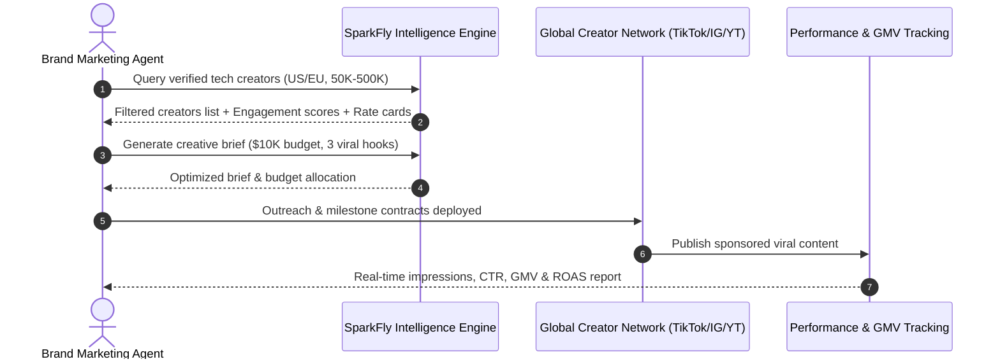

# genpark-sparkfly-influencer-marketing-creator-intelligence-skill

   

> **GenPark AI Agent Skill** — SparkFly (Tec-Do 2.0) creator intelligence, cross-border influencer discovery, and TikTok/Instagram/YouTube campaign ROI attribution.

[SparkFly](https://sparkfly.net/) is a global creator marketing and globalization intelligence platform powered by Tec-Do 2.0. It empowers brands to connect with verified creators, deploy viral content strategies, and track multichannel conversion attribution.

---

## ⚡ Key Capabilities
- **Cross-Border Creator Discovery**: Programmatic sourcing across TikTok, Instagram, and YouTube filtered by engagement rates, demographics, and verified GMV track record.
- **AI-Powered Creative Briefing**: Automated generation of localized short-video scripts, viral hooks, and talking points.
- **ROI & Attribution Modeling**: Predict impressions, clicks, conversion rates, and ROAS prior to campaign deployment.
- **Model Context Protocol (MCP)**: Native tool-calling integration for autonomous agent systems, Claude Desktop, and GenPark Commerce Copilot.

---

## 📊 Architecture Workflow



---

## 🚀 Quick Start
```bash
python example_usage.py
```

## 🔌 Model Context Protocol (MCP) Server
```bash
python mcp_server.py
```
